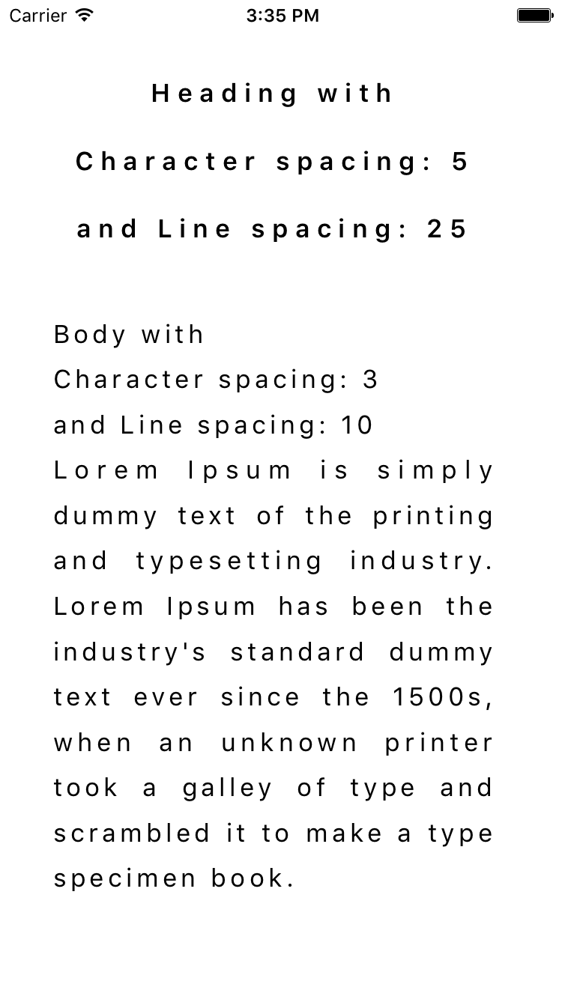
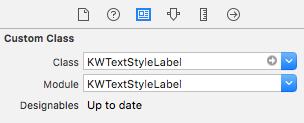
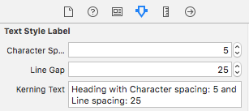

# KWTextStyleLabel



[](https://www.bitrise.io/app/7af1764622c959f9)
[](http://cocoapods.org/pods/KWTextStyleLabel)
[](http://cocoapods.org/pods/KWTextStyleLabel)
[](http://cocoapods.org/pods/KWTextStyleLabel)

## Example

To run the example project, clone the repo, and run `pod install` from the Example directory first.

## Requirements

## Installation

KWTextStyleLabel is available through [CocoaPods](http://cocoapods.org). To install
it, simply add the following line to your Podfile:

```ruby
pod "KWTextStyleLabel"
```

## How to use

#### Add the class KWTextStyleLabel to label on storyboard



#### Modifying character spacing and line spacing using storyboard



#### Or modifying character spacing and line spacing programmatically

```swift
import KWTextStyleLabel

@IBOutlet weak var label: KWTextStyleLabel!

label.characterSpacing = 3
label.lineGap = 10
label.text = "Lorem Ipsum is simply dummy text of the printing and typesetting industry."
```
#### Can create label with KWTextStyleLabel initializer

```swift
let label = KWTextStyleLabel(characterSpacing: 5, lineGap: 25, text: "Lorem Ipsum")
label.frame = CGRect(x: 8, y: 0, width: 296, height: 122)
view.addSubview(label)
```

#### KWTextStyleLabel initializer have 3 different optional parameters

```swift
KWTextStyleLabel()
KWTextStyleLabel(characterSpacing: <CGFloat>)
KWTextStyleLabel(lineGap: <CGFloat>)
KWTextStyleLabel(text: <String>)
KWTextStyleLabel(characterSpacing: <CGFloat>, lineGap: <CGFloat>)
KWTextStyleLabel(lineGap: <CGFloat>, text: <String>)
KWTextStyleLabel(characterSpacing: <CGFloat>, text: <String>)
```

## Author

KeepWorks, ios@keepworks.com

## Credits

KWTextStyleLabel is owned and maintained by the [KeepWorks](http://www.keepworks.com/).

[](http://www.keepworks.com/)

## Contributing

Bug reports and pull requests are welcome on GitHub at https://github.com/keepworks/KWTextStyleLabel.

## License

KWTextStyleLabel is available under the [MIT License](http://opensource.org/licenses/MIT). See the [License](https://github.com/keepworks/KWTextStyleLabel/blob/master/LICENSE) file for more info.
