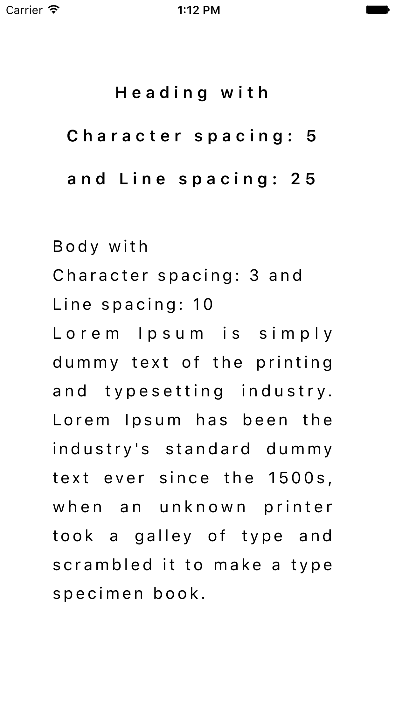
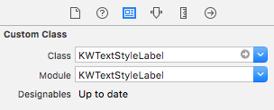
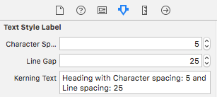

# KWTextStyleLabel



[](https://travis-ci.org/Vinoth Anandan/KWTextStyleLabel)
[](http://cocoapods.org/pods/KWTextStyleLabel)
[](http://cocoapods.org/pods/KWTextStyleLabel)
[](http://cocoapods.org/pods/KWTextStyleLabel)

## Example

To run the example project, clone the repo, and run `pod install` from the Example directory first.

## Requirements

## Installation

KWTextStyleLabel is available through [CocoaPods](http://cocoapods.org). To install
it, simply add the following line to your Podfile:

```ruby
pod "KWTextStyleLabel"
```

## How to use
#
#### Add the class KWTextStyleLabel to label on storyboard
#
#

#
#### Modifying character spacing and line spacing using storyboard
#
#

#
#### Or modifying character spacing and line spacing by programmatically
#
#
```swift
@IBOutlet weak var label: KWTextStyleLabel!

label.characterSpacing = 3
label.lineGap = 10
label.text = "Lorem Ipsum is simply dummy text of the printing and typesetting industry."
```

## Author

Vinoth Anandan, vinoth@keepworks.com

## Credits

KWTextStyleLabel is owned and maintained by the [KeepWorks](http://www.keepworks.com/).

[](http://www.keepworks.com/)

## Contributing

Bug reports and pull requests are welcome on GitHub at https://bitbucket.org/keepworks/kwtextstylelabel.

## License

KWTextStyleLabel is available under the [MIT License](http://opensource.org/licenses/MIT). See the LICENSE file for more info.
